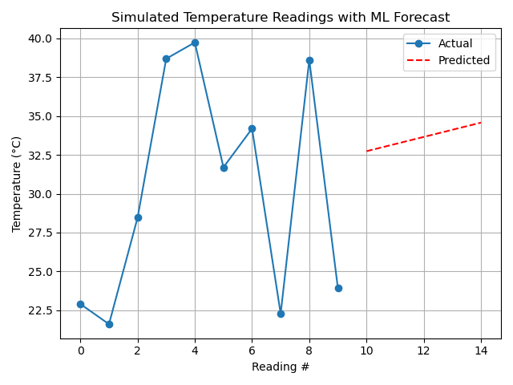

# 🌡️ Enterprise Temperature Analytics Platform


**From IoT Simulation to Machine Learning Forecasts.**

Welcome to the **Enterprise Temperature Analytics Platform**. This professional-grade application simulates high-fidelity sensor data, securely logs it for audit trails, and leverages advanced Machine Learning (Linear Regression) to predict future temperature trends. It is designed with modularity, scalability, and 12-Factor App principles in mind.

---

## 📊 Visual Analytics

The platform automatically generates insightful visualizations to help you understand temperature trends at a glance.


*Figure 1: The **Blue Line** represents actual historical sensor readings, while the **Red Dashed Line** indicates the AI-generated forecast for future time steps.*

---

## 📂 Project Architecture

We follow a clean, modular "Separation of Concerns" architecture to ensure maintainability and testability.

```text
temperature_logger/
├── src/
│   ├── main.py          # 🏁 Application Entry Point
│   ├── sensor.py        # 🔌 Hardware Abstraction Layer
│   ├── storage.py       # 💾 Data Persistence (CSV)
│   ├── analysis.py      # 🧠 Machine Learning Logic
│   └── visualization.py # 📈 Plotting & Reporting
├── tests/               # 🧪 Unit Test Suite
├── Dockerfile           # 🐳 Container Definition
└── requirements.txt     # 📦 Dependency Manifest
```

---

## 🚀 Quick Start

Get up and running in seconds.

### 1. Installation

Ensure you have Python 3.9+ installed, then grab the dependencies:

```bash
pip install -r requirements.txt
```

### 2. Running Locally

Launch the platform to collect data and generate forecasts:

```bash
# Standard execution (10 readings, 5 predictions)
python -m src.main

# Custom configuration
python -m src.main --readings 20 --delay 0.5 --predict 10
```

---

## 🐳 Docker Support

Deploy anywhere with our production-ready Docker container.

```bash
# 1. Build the image
docker build -t temperature-logger .

# 2. Run the container (with volume mount for persistent data)
docker run -v $(pwd)/data:/app/data temperature-logger
```

---

## 🧪 Testing

We take quality seriously. Run the full test suite to verify system integrity:

```bash
pytest tests/
```

---

## ⚙️ Configuration

Fine-tune the platform using Environment Variables or CLI arguments.

| Variable | CLI Flag | Default | Description |
| :--- | :--- | :--- | :--- |
| `READINGS` | `--readings` | `10` | Number of sensor data points to collect |
| `DELAY` | `--delay` | `1` | Seconds to wait between readings |
| `PREDICT` | `--predict` | `5` | Number of future steps to forecast |
| `CSV_FILENAME` | N/A | `temperature_log.csv` | File path for the data log |
| `PLOT_FILENAME` | N/A | `forecast_plot.png` | File path for the generated plot |

---

*Built with ❤️ by the DevOps Team.*
